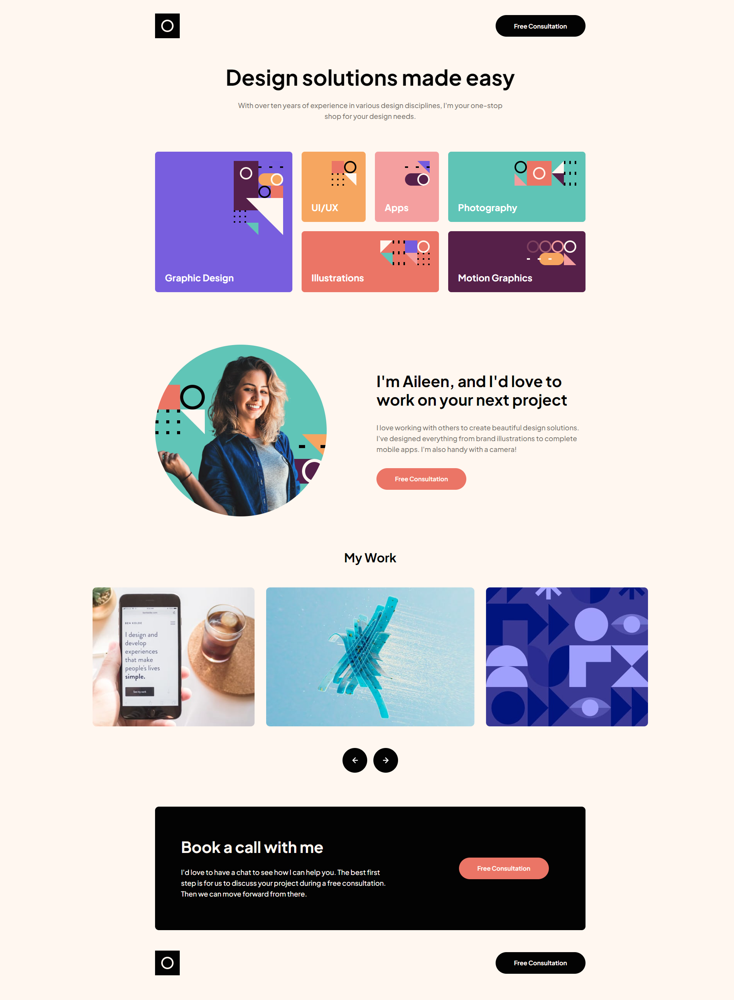

# Single-page design portfolio

This is a solution to Single-page design portfolio.

The users should be able to:

- View the optimal layout for the site depending on their device's screen size
- See hover states for all interactive elements on the page
- Navigate the slider using either their mouse/trackpad or keyboard

## Table of contents

- [Link](#link)
- [Screenshots](#Screenshots)
- [Built with](#built-with)
- [Author](#author)

## Link

- Solution URL: [Single-page design portfolio]()

## Screenshots

## Built with

- Semantic HTML5 markup
- CSS custom properties
- Flexbox
- CSS Grid
- [Flickity Image Slider](https://flickity.metafizzy.co/)

## Author

- Website - [Xiaomin Guo](https://min-website-aislandmin.vercel.app/)
